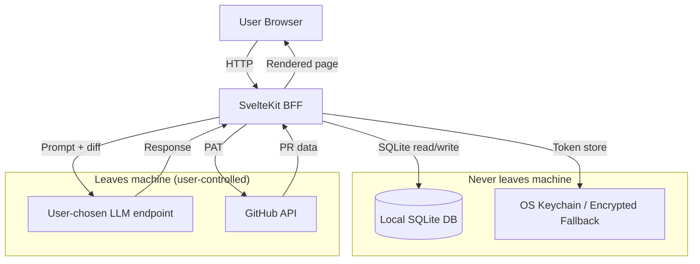

# Privacy & Data Flow

## Data Flow Diagram

## What Leaves Your Machine

| Data | Destination | User-controlled |
|------|-------------|----------------|
| LLM prompts (diff chunks + questions) | User-configured LLM endpoint | Yes — endpoint + model chosen in onboarding |
| GitHub PAT + API calls | api.github.com | Yes — PAT stored locally, calls made directly |
| Crash/telemetry data | — | **None collected** |

## What Stays Local

- **SQLite database** — sessions, answers, debriefs, mastery scores, repo conventions
- **API keys** — stored in OS keychain (keytar) or AES-256-GCM encrypted file fallback bound to machine-id
- **Sound preferences** — localStorage in browser
- **Theme preference** — localStorage in browser
- **Bundles (downloaded PR data)** — local filesystem only

## Data Retention

- All data persists until the user explicitly clears it via **Settings → Data & Keys**.
- No automatic expiry or pruning in v1.
- `DELETE /api/data/clear` removes sessions, answers, debriefs, and activity records.
- `DELETE /api/keys/clear` removes all stored API keys from keychain/fallback.

## Keychain Fallback

When the OS keychain is unavailable (e.g., headless Linux without libsecret), Lectern falls back to an AES-256-GCM encrypted file. The encryption key is derived from the machine-id via argon2id. This file is bound to the machine and cannot be decrypted on a different machine.

A warning is logged: `"Secure keychain unavailable; using machine-bound encrypted file."`

## V1 Ruled-Out Features

These features are explicitly **not** in v1:

- **Telemetry / analytics** — no data is sent to Lectern servers
- **Cloud sync** — no remote backup or sync of local data
- **Account system** — no login, no user accounts, no server-side storage
- **Third-party sharing** — no data shared with any third party
- **Browser extensions** — no browser extension that could access page content
- **Automatic updates** — user controls update cadence
- **GitLab support** — deferred to v1.1
- **Multi-model routing** — single LLM endpoint in v1
